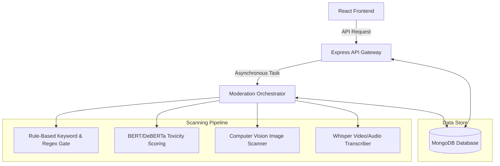
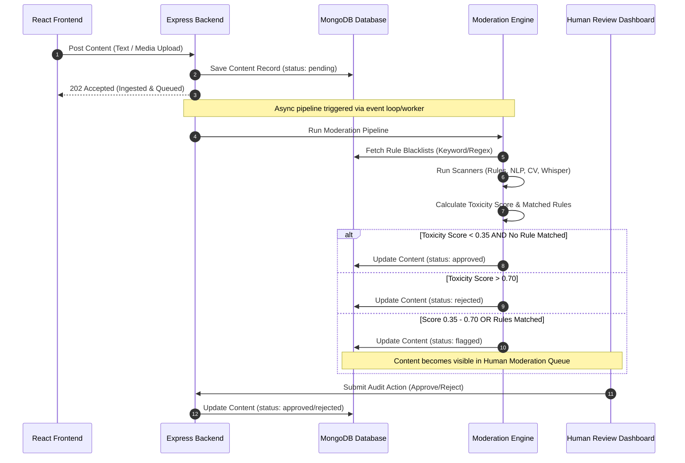

# SafeNet System Architecture & Design Documentation

SafeNet is an enterprise-grade, multi-modal content moderation system. It combines high-throughput rule-based gates, AI-driven media scanners, and a real-time human review workflow into a unified pipeline to safeguard user-generated content.

---

## 1. System Overview

SafeNet processes text, images, and videos submitted by users in real time. It evaluates the content against safety policies and automatically approves, rejects, or routes flagged content to human moderation queues.

### High-Level Architecture (Simplified)


### High-Level Architecture (Detailed)





---

## 2. Ingest & Moderation Pipeline Workflow

Every content payload ingested follows a strict processing lifecycle:



---

## 3. Detailed Component Architecture

### Moderation Pipeline Hierarchy Pyramid


### A. Ingestion Service
- **Platform**: Node.js + Express + TypeScript.
- **Media Storage**: Uses `multer` middleware. If configured, files are uploaded directly to **Cloudinary**; otherwise, they fall back to local disk storage (`/uploads`) for local testing.
- **Endpoint**: `POST /api/content/ingest`
- **Behavior**: Returns a `202 Accepted` status code immediately after storing metadata, ensuring low latency for client requests while processing the pipeline asynchronously using `process.nextTick()`.

### B. Automated Moderation Engine
The engine combines deterministic matching with probabilistic AI classifiers:
1. **Rule-Based Matcher**:
   - Fetches active rules from the `Rule` collection.
   - Evaluates content against `KEYWORD` rules (exact phrase/word boundaries) and custom `REGEX` rules (to catch evasion patterns such as character-substitution or letter-stretching, e.g., `k.i.l.l`).
2. **Natural Language Processing (NLP) / Toxicity Classifier**:
   - Represents a deep learning sentiment/toxicity classifier (e.g., BERT or DeBERTa).
   - Generates a toxicity score from `0.00` to `1.00`.
   - Score increases based on rule matches (e.g., Hate Speech adds `0.50`, Violence adds `0.45`) and semantic triggers (e.g., "giveaway", "scam").
3. **Computer Vision (CV) Scanner**:
   - Inspects uploaded images for safety hazards.
   - Evaluates visual tags such as `NSFW_CONTENT`, `GORE_VIOLENCE`, and `SPAM_BANNER`.
4. **Audio & Video Analytics (Whisper)**:
   - Processes video assets.
   - Transcribes audio content to text using a simulated **Whisper Speech-to-Text API** and runs rules against the transcript.
   - Scans frames for explicit tags.

### C. Decision Matrix (Thresholds)
- **Toxicity Score < 0.35**: `AUTO_ALLOW` / `approved`.
- **Toxicity Score > 0.70**: `AUTO_REMOVE` / `rejected`.
- **Toxicity Score 0.35 - 0.70 OR Match list is non-empty**: `HUMAN_REVIEW` / `flagged`. Routes to the moderation queue.

### D. Human Moderator Review Dashboard
- **Queues**: Displays real-time interactive panels of `flagged`, `approved`, and `rejected` content.
- **Controls**: Moderators can review payloads, visual media, matched safety violations, and execute final audit verdicts: **Approve** or **Reject**.
- **Rule Manager**: A dashboard allowing moderators to add, edit, or delete keyword/regex rules on the fly without system restarts.
- **Telemetry Charts**: Displays data analytics using Recharts (ingested content trends, policy violation breakdowns, queue SLA stats).

---

## 4. Data Models (Database Schema)

### Figure 4: SafeNet Database Schema (ERD)


### 1. `User` Schema
Tracks authenticated system users and moderators.
- `name`: String
- `email`: String (Unique)
- `password`: Hashed String
- `role`: `'user' | 'moderator'` (Default: `'user'`)

### 2. `Content` Schema
Stores user posts, media metadata, and moderation results.
- `userId`: ObjectId (ref: `User`)
- `contentType`: `'text' | 'image' | 'video'`
- `textPayload`: String (Optional)
- `mediaUrl`: String (Optional)
- `cloudinaryPublicId`: String (Optional)
- `status`: `'pending' | 'under_review' | 'approved' | 'rejected' | 'flagged'` (Default: `'pending'`)
- `createdAt`: Date

### 3. `Rule` Schema
Defines dynamic keyword and regular expression matchers.
- `pattern`: String
- `ruleType`: `'KEYWORD' | 'REGEX'`
- `label`: `'HATE_SPEECH' | 'SPAM' | 'VIOLENCE' | 'EXPLICIT'`
- `createdAt`: Date

### 4. `AuditLog` Schema
Records action logs when a human moderator overrides or resolves content.
- `contentId`: ObjectId (ref: `Content`)
- `moderatorId`: ObjectId (ref: `User`)
- `action`: `'approved' | 'rejected'`
- `timestamp`: Date

---

## 5. API Reference Endpoints

### Authentication Module
*   `POST /api/auth/register`: Create a new user or moderator account.
*   `POST /api/auth/login`: Validate credentials and issue a JSON Web Token (JWT).
*   `GET /api/auth/profile`: Fetch current logged-in user profile details (requires Auth Header).

### Content Ingestion Module
*   `POST /api/content/ingest`: Accepts multipart/form-data with fields:
    - `contentType`: `'text' | 'image' | 'video'`
    - `textPayload`: String (required for text type)
    - `file`: File upload (required for image/video types)
*   `GET /api/content/history`: Fetches submission history of the currently logged-in user.

### Review & Audit Module (Moderators Only)
*   `GET /api/review/pending`: Get all `flagged` contents currently waiting in the moderation queue.
*   `POST /api/review/:contentId/audit`: Commit a manual verdict (Body: `{ action: "approved" | "rejected" }`).
*   `GET /api/review/history`: Fetch logs of past actions taken by moderators.
*   `GET /api/review/rules`: List all dynamic keyword and regex filtering rules.
*   `POST /api/review/rules`: Add a new rule (Body: `{ pattern: String, ruleType: "KEYWORD" | "REGEX", label: "HATE_SPEECH" | "SPAM" | "VIOLENCE" | "EXPLICIT" }`).
*   `DELETE /api/review/rules/:id`: Remove a filtering rule by ID.
*   `GET /api/review/stats`: Get dashboard statistics (percentages of violations, queue averages, overall throughput).

---

## 6. System Quality Attributes & Scalability Plan

### A. Scalability & Performance
To upgrade SafeNet from a prototype to a high-capacity system, the following design improvements should be applied:
1. **Message Broker / Task Queue**: Replace the in-memory `process.nextTick()` async runner with a robust job worker pattern like **BullMQ** (powered by Redis) or **RabbitMQ**. This protects the server from falling over when receiving sudden traffic spikes.
2. **Horizontal Scaling**: Run the ingestion gateway as stateless servers behind a Load Balancer (NGINX/AWS ALB) while spinning up dedicated Python/Node worker nodes to handle heavy machine learning scanning processes.
3. **Database Indexing**: Build database indexes on MongoDB for faster search queries:
   ```javascript
   db.contents.createIndex({ status: 1, createdAt: -1 });
   db.contents.createIndex({ userId: 1 });
   ```

### B. Security & Integrity
- **Authentication & Authorization**: All sensitive APIs are guarded by JWT authorization. Endpoints under `/api/review` verify if the user's role is strictly `'moderator'`.
- **Media Scan Isolation**: Uploaded files should be scanned for malware before being saved or sent to Cloudinary storage.

---

## 7. Setup & Verification

### Prerequisite Configurations
Ensure your `.env` contains the required database connections:
```env
PORT=5050
MONGO_URI=mongodb://localhost:27017/safenet
JWT_SECRET=your_jwt_signing_secret_here
```

### Local Testing & Python Simulation
You can run a local simulation of the rule-based scanner using the standalone `moderation_simulator.py` script:
```bash
python3 moderation_simulator.py
```
This script evaluates sample inputs against the core rule-matching algorithms and classifies the results according to `AUTO_ALLOW`, `HUMAN_REVIEW`, and `AUTO_REMOVE` thresholds.
